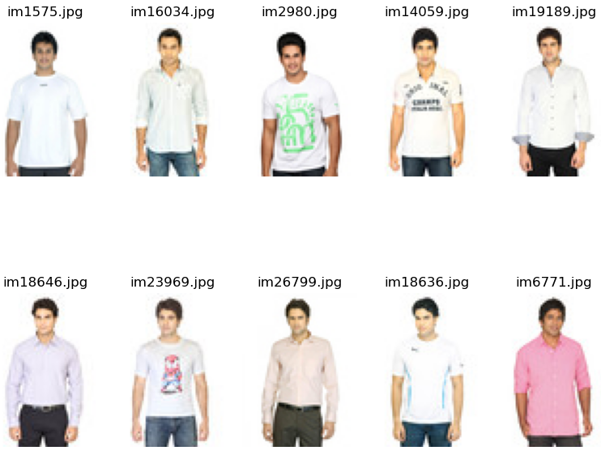
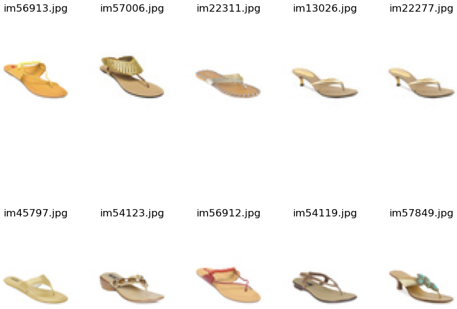

# image-similarity-search

Image similarity search is a technique used to find images that are visually similar to a given query image. It involves extracting features from a dataset of images and comparing them using a similarity metric. This can be useful in applications such as image retrieval, recommendation systems, and content-based image analysis.

## Examples
The input image is represented in the first image. The following nine images show the recommendations, which are predicted to have the highest similarity to the input image.

Example 1:

Example 2:

## Steps

1. **Feature extraction**: A pre-trained Resnet18 CNN is used in order to extract a 512-dimensional feature vector of an image. This is done for all images included in the dataset. The extracted features are stored on disk for later use.
2. **Indexing**: Currently, the images with the highest similarity are being located through a linear search. This could be optimized through the use of an inverted index, k-d trees, or locality sensitive hashing for large datasets.
3. **Querying and Ranking**: The index can be applied to find analogous images to the query image by looking up images with alike embeddings. Finally, the retrieved images can be ranked based on their similarity to the query image using metrics such as euclidean distance or cosine similarity.
